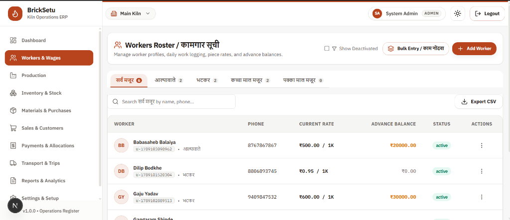
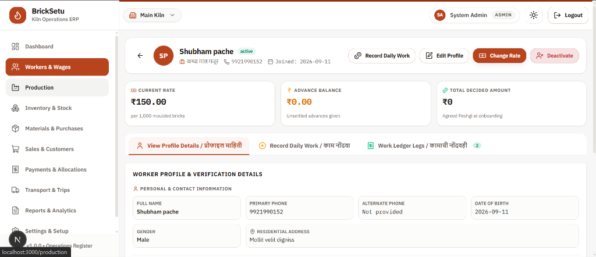
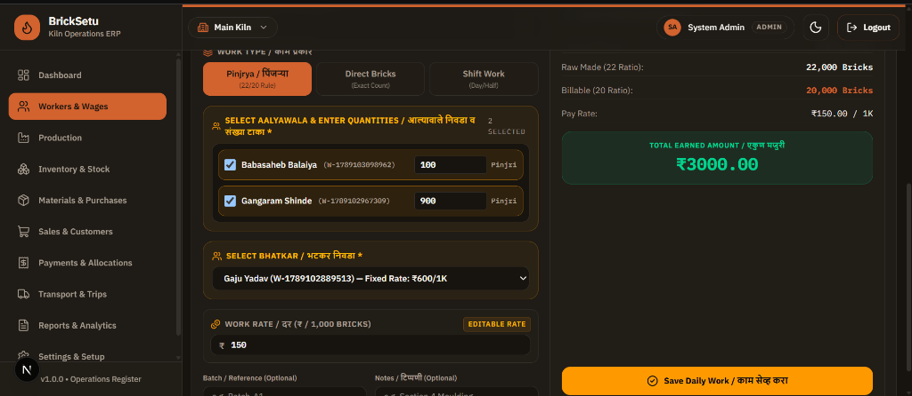

# 🧱 BrickSetu (ब्रिकसेतू) - Kiln Operations ERP

[](https://nextjs.org/)
[](https://react.dev/)
[](https://www.typescriptlang.org/)
[](https://tailwindcss.com/)
[](https://www.prisma.io/)
[](https://supabase.com/)

An end-to-end **Enterprise Resource Planning (ERP) & Operations Management Platform** specifically architected for traditional and modern **Brick Kiln Operations (ईट भट्टी)**. **BrickSetu** digitizes piece-rate labor tracking, complex multi-tier wage settlements, inventory, batch moulding-to-firing workflows, raw materials consumption, and financial ledgers.

---

## 📸 System Screenshots

### 1. Workers Roster & Category Management (कामगार सूची)
Bilingual interface supporting Marathi and English. Allows categorization by roles (*सर्व मजूर, आल्यावाले, भटकर, कच्चा माल मजूर, पक्का माल मजूर*), real-time search, rate tracking, advance balance monitoring, and bulk daily work entry.



### 2. Worker Profile & Advance Balance Ledger
Comprehensive view of individual worker earnings, agreed-upon piece rates, unsettled advance balances (*Peshgi* / advance payments), and work log history.



### 3. Daily Work Logging & Pinjrya Rule Calculation (Dark Theme)
Transactional piece-rate recording with automated business logic (e.g., **Pinjrya 22/20 ratio rule** converting raw brick counts into billable quantities and calculating net earnings instantly).



---

## 🔥 Key Features

### 👥 Workers & Piece-Rate Wage Management
- **Bilingual UI**: Native support for Marathi (मराठी) and English operational terminology.
- **Categorized Labor Roster**: Filter and manage workers across specialized kiln roles:
  - **कच्चा माल मजूर** (Raw Material Workers)
  - **आल्यावाले** (Moulding / Layering Workers)
  - **भटकर** (Kiln Operators / Stackers)
  - **पक्का माल मजूर** (Finished Goods / Unloading Workers)
- **Automated Piece-Rate Rules**: Custom calculation logic including the **Pinjrya 22/20 ratio rule** for raw-to-billable brick conversions.
- **Advance (*Peshgi*) Ledger**: Real-time tracking of wage advances, running balances, and automatic deductions during settlement.
- **Weekly Settlement Engine**: Multi-state wage settlement workflow (Draft → Approved → Paid) ensuring accurate payroll and zero double-billing.

### 🧱 Kiln Batch & Production Lifecycle
- **Batch Tracking**: Monitor kiln batches from initial moulding through drying, firing, and final stock yield.
- **Yield & Waste Calculation**: Track good bricks vs. damaged/waste percentage per batch cycle.
- **3-Way Transactional Logging**: Synchronously log piece-rate work across raw material handlers, moulders, and stackers.

### 📦 Inventory & Raw Materials Management
- **Stock Classification**: Inventory breakdown by brick grades (Class 1, Class 2, and Waste/Broken).
- **FIFO Material Lots**: FIFO-based lot consumption tracking for key raw materials (Coal, Clay, Sand, Wood, Diesel).
- **Audit-Logged Stock Adjustments**: Immutable stock movement logs with mandatory audit trail reasons.

### 💰 Finance, Sales & Logistics
- **Party Ledgers**: Complete financial ledger for customers and suppliers with payment allocation tracking.
- **Customer Sales & Delivery**: Sales order recording, partial payment allocations, and outstanding balance alerts.
- **Transport & Vehicle Tracking**: Track owned and hired delivery trucks, driver pay, and trip-wise freight costs.
- **Operating Profit Analytics**: Comprehensive batch costing, labor breakdown, and operating profit reports.

---

## 🛠️ Technology Stack

| Domain | Technology | Description |
| :--- | :--- | :--- |
| **Frontend Framework** | **Next.js 16 (App Router)** | Fullstack Server & Client components architecture |
| **UI & Styling** | **Tailwind CSS v4 + Base UI** | Modern design system with dark/light mode via `next-themes` |
| **Icons & Notifications** | **Lucide React + Sonner** | Crisp icons and toast notification system |
| **State & Data Fetching** | **TanStack React Query v5** | Server-state management and caching |
| **Forms & Validation** | **React Hook Form + Zod** | Strongly-typed form validation schemas |
| **Database ORM** | **Prisma 7 (Multi-schema)** | Modular Prisma schema setup (`core`, `workers`, `production`, `finance`, etc.) |
| **Database & Auth** | **PostgreSQL (Supabase)** | PostgreSQL database with connection pooling and Supabase SSR auth |

---

## 📁 Repository Structure

```text
brick-setu/
├── app/                  # Next.js App Router pages, API route handlers, and layouts
├── components/           # Reusable UI components (buttons, dialogs, forms, badges)
├── features/             # Domain-driven feature modules (workers, production, inventory, sales)
├── lib/                  # Database connections, authentication handlers, API utilities
├── prisma/
│   └── schema/           # Multi-file Prisma schemas (workers, core, finance, sales, inventory)
├── public/
│   └── screenshots/      # Application screenshots and assets
├── docs/                 # Architectural specifications, migration guides, and feature plans
├── types/                # Shared TypeScript domain definitions
└── middleware.ts         # Authentication and route protection middleware
```

---

## 🚀 Getting Started

### Prerequisites

Ensure you have the following installed on your environment:
- **Node.js**: `v20.x` or higher
- **npm** / **yarn** / **pnpm**
- **PostgreSQL Database** (or a [Supabase](https://supabase.com/) project)

### Installation

1. **Clone the Repository**
   ```bash
   git clone https://github.com/vishalbodkhe531/Bricksetu.git
   cd Bricksetu
   ```

2. **Install Dependencies**
   ```bash
   npm install
   ```

3. **Generate Prisma Client & Push Database Schema**
   ```bash
   npx prisma generate
   ```

4. **Run Development Server**
   ```bash
   npm run dev
   ```

5. Open [http://localhost:3000](http://localhost:3000) in your browser.

---

## 📜 Scripts

| Command | Description |
| :--- | :--- |
| `npm run dev` | Starts the Next.js development server |
| `npm run build` | Generates Prisma client and builds production bundle |
| `npm run start` | Starts the Next.js production server |
| `npm run lint` | Runs ESLint code quality checks |

---

## 🔒 License & Usage

Private project developed for Kiln Operations ERP. All rights reserved.
