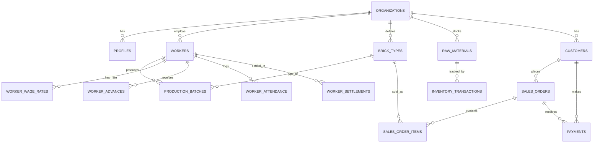

# BrickSetu — Supabase Integration & End-to-End Architecture Plan

> **Assumptions made in this plan** (correct me if wrong and I'll adjust):
> - Stack: **Next.js (App Router) + TypeScript**, currently using Server Actions (`actions.ts`) and ad-hoc query files (`queries.ts`).
> - Backend: migrating to **Supabase (PostgreSQL + Auth + Storage)**.
> - You want a real HTTP API layer for client-side data access (via Axios + TanStack Query), but server-rendered pages should **not** round-trip through your own HTTP API — they should call the data layer directly for speed.
> - This is a single-team internal business tool (owner/manager/accountant/worker roles), not a public multi-tenant SaaS — but I've designed the schema to support multiple kiln sites under one business, since that's common in this industry. Flag if you want strict single-site instead.

---

## Table of Contents

1. [Goals & Non-Goals](#1-goals--non-goals)
2. [High-Level Architecture](#2-high-level-architecture)
3. [Feature-Based Folder Structure](#3-feature-based-folder-structure)
4. [Database Schema (Supabase / PostgreSQL)](#4-database-schema-supabase--postgresql)
5. [Auth, RBAC & Password Security](#5-auth-rbac--password-security)
6. [Row Level Security (RLS) Strategy](#6-row-level-security-rls-strategy)
7. [API Layer Design](#7-api-layer-design)
8. [Axios Setup](#8-axios-setup)
9. [TanStack Query Setup](#9-tanstack-query-setup)
10. [Custom Hooks Pattern (per feature)](#10-custom-hooks-pattern-per-feature)
11. [Caching Strategy (Frontend + Backend)](#11-caching-strategy-frontend--backend)
12. [When to Use React Context (and when not to)](#12-when-to-use-react-context-and-when-not-to)
13. [Performance Optimization Checklist](#13-performance-optimization-checklist)
14. [Environment Variables](#14-environment-variables)
15. [Step-by-Step Migration Plan](#15-step-by-step-migration-plan)
16. [Additional Suggestions & Open Questions](#16-additional-suggestions--open-questions)

---

## 1. Goals & Non-Goals

**Goals**
- Single source of truth for data access (no scattered `queries.ts` logic).
- Clear separation: **service layer** (talks to Supabase) → consumed by **API routes** (for client) and **directly by server components/actions** (for SSR, no HTTP overhead).
- Client-side interactivity (forms, tables, mutations) goes through **Axios + TanStack Query**, with proper caching and invalidation.
- Strong data security: RLS on every table, hashed credentials via Supabase Auth, service-role key never exposed to the browser.
- Feature-based, testable, scalable folder structure.
- Fast perceived performance (skeletons, prefetching, pagination, no waterfalls).

**Non-Goals (for this phase)**
- Offline-first / PWA sync — flagged as an open question below, not designed here.
- Multi-language i18n implementation — flagged below, not detailed here.

---

## 2. High-Level Architecture

```
┌─────────────────────────────┐        ┌─────────────────────────────┐
│   Client Components (CSR)   │        │  Server Components / Actions │
│  Forms, tables, dashboards  │        │  Initial page loads, SSR     │
└──────────────┬───────────────┘        └───────────────┬───────────────┘
               │ Axios + TanStack Query                  │ direct function call
               ▼                                          ▼
     ┌────────────────────┐                    ┌────────────────────────┐
     │  /app/api/** routes │ ─── calls same ──▶ │   Service Layer         │
     │  (Route Handlers)   │                    │  features/*/services/*  │
     └────────────────────┘                    └────────────┬────────────┘
                                                              │ supabase-js
                                                              ▼
                                                   ┌─────────────────────┐
                                                   │   Supabase (Postgres)│
                                                   │   Auth · RLS · Storage│
                                                   └─────────────────────┘
```

**Key rule:** Server Components never call `fetch('/api/...')` on your own domain — that's a wasted network hop on the same server. They import the **service layer** directly. Only the **browser** talks to `/api/**`, and it does so via Axios + TanStack Query.

---

## 3. Feature-Based Folder Structure

```
src/
├── app/
│   ├── (auth)/
│   │   ├── login/page.tsx
│   │   └── register/page.tsx
│   ├── (dashboard)/
│   │   ├── workers/page.tsx
│   │   ├── production/page.tsx
│   │   ├── inventory/page.tsx
│   │   ├── sales/page.tsx
│   │   ├── payments/page.tsx
│   │   ├── customers/page.tsx
│   │   └── reports/page.tsx
│   └── api/
│       ├── workers/route.ts            # GET, POST
│       ├── workers/[id]/route.ts       # GET, PATCH, DELETE
│       ├── production/route.ts
│       ├── inventory/route.ts
│       ├── sales-orders/route.ts
│       ├── payments/route.ts
│       └── customers/route.ts
│
├── features/
│   ├── workers/
│   │   ├── services/workers.service.ts      # pure Supabase queries (server-only)
│   │   ├── hooks/useWorkers.ts               # TanStack Query hooks (client)
│   │   ├── hooks/useCreateWorker.ts
│   │   ├── api/workers.api.ts                # axios calls hitting /api/workers
│   │   ├── components/WorkerTable.tsx
│   │   ├── components/WorkerForm.tsx
│   │   └── types/worker.types.ts
│   ├── production/    (same shape)
│   ├── inventory/     (same shape)
│   ├── sales/         (same shape)
│   ├── payments/      (same shape)
│   ├── customers/     (same shape)
│   ├── reports/       (same shape)
│   └── auth/          (same shape)
│
├── lib/
│   ├── supabase/
│   │   ├── client.ts       # browser client (anon key)
│   │   ├── server.ts       # server client (cookies, per-request)
│   │   └── admin.ts        # service-role client — server-only, never imported client-side
│   ├── axios/axiosInstance.ts
│   └── query/
│       ├── queryClient.ts
│       └── queryKeys.ts
│
├── context/
│   ├── AuthContext.tsx     # session/user only — see §12
│   └── UIContext.tsx       # sidebar/theme toggle — trivial UI state only
│
├── types/                  # shared/global types (Database type from Supabase codegen)
└── utils/
```

**Rule of thumb:** a page component should only ever import from `features/*/hooks` and `features/*/components`. It should never call `axios` or `supabase` directly.

---

## 4. Database Schema (Supabase / PostgreSQL)

### 4.1 Entity relationship overview



### 4.2 Core / Auth tables

```sql
-- Business entity (supports multiple kiln sites under one owner account)
create table organizations (
  id uuid primary key default gen_random_uuid(),
  name text not null,
  address text,
  created_at timestamptz not null default now()
);

-- Extends Supabase auth.users — never store passwords here, Supabase Auth handles that
create table profiles (
  id uuid primary key references auth.users(id) on delete cascade,
  organization_id uuid not null references organizations(id),
  full_name text not null,
  phone text,
  role text not null check (role in ('owner','manager','supervisor','accountant','viewer')),
  is_active boolean not null default true,
  created_at timestamptz not null default now()
);
```

### 4.3 Workers & Wages

```sql
create table workers (
  id uuid primary key default gen_random_uuid(),
  organization_id uuid not null references organizations(id),
  full_name text not null,
  phone text,
  address text,
  id_proof_number text,          -- consider column-level encryption, see §5.3
  photo_url text,
  category text,                 -- moulder / fireman / loader / etc.
  joining_date date,
  status text not null default 'active' check (status in ('active','inactive')),
  created_at timestamptz not null default now()
);

create table worker_wage_rates (
  id uuid primary key default gen_random_uuid(),
  worker_id uuid not null references workers(id) on delete cascade,
  rate_type text not null check (rate_type in ('per_1000_bricks','daily','monthly')),
  rate_amount numeric(10,2) not null,
  effective_from date not null,
  effective_to date,
  created_at timestamptz not null default now()
);

create table worker_advances (
  id uuid primary key default gen_random_uuid(),
  worker_id uuid not null references workers(id) on delete cascade,
  amount numeric(10,2) not null,
  date_given date not null,
  reason text,
  created_at timestamptz not null default now()
);

create table worker_attendance (
  id uuid primary key default gen_random_uuid(),
  worker_id uuid not null references workers(id) on delete cascade,
  attendance_date date not null,
  status text not null check (status in ('present','absent','half_day')),
  unique (worker_id, attendance_date)
);

create table worker_settlements (
  id uuid primary key default gen_random_uuid(),
  worker_id uuid not null references workers(id) on delete cascade,
  period_start date not null,
  period_end date not null,
  gross_wage numeric(10,2) not null,
  advances_deducted numeric(10,2) not null default 0,
  net_payable numeric(10,2) not null,
  status text not null default 'pending' check (status in ('pending','paid')),
  paid_on date,
  created_at timestamptz not null default now()
);
```

### 4.4 Production & Inventory

```sql
create table brick_types (
  id uuid primary key default gen_random_uuid(),
  organization_id uuid not null references organizations(id),
  name text not null,           -- e.g. "Standard Red Brick 9x4x3"
  dimensions text,
  created_at timestamptz not null default now()
);

create table production_batches (
  id uuid primary key default gen_random_uuid(),
  organization_id uuid not null references organizations(id),
  worker_id uuid references workers(id),
  brick_type_id uuid not null references brick_types(id),
  production_date date not null,
  bricks_moulded integer not null check (bricks_moulded >= 0),
  notes text,
  created_by uuid references profiles(id),
  created_at timestamptz not null default now()
);

create table raw_materials (
  id uuid primary key default gen_random_uuid(),
  organization_id uuid not null references organizations(id),
  name text not null,           -- coal, clay, sand...
  unit text not null            -- kg, ton, truck
);

create table inventory_transactions (
  id uuid primary key default gen_random_uuid(),
  organization_id uuid not null references organizations(id),
  item_type text not null check (item_type in ('raw_material','finished_goods')),
  item_id uuid not null,        -- points to raw_materials.id or brick_types.id
  transaction_type text not null check (transaction_type in ('in','out')),
  quantity numeric(12,2) not null,
  reference_type text,          -- purchase / production / sale / adjustment
  reference_id uuid,
  transaction_date date not null default current_date,
  created_by uuid references profiles(id),
  created_at timestamptz not null default now()
);
```

> Current stock is best served by a **view** (`select item_id, sum(case when transaction_type='in' then quantity else -quantity end) as stock ...`) rather than a manually-maintained counter — avoids drift.

### 4.5 Sales, Customers, Payments

```sql
create table customers (
  id uuid primary key default gen_random_uuid(),
  organization_id uuid not null references organizations(id),
  name text not null,
  phone text,
  address text,
  gst_number text,
  created_at timestamptz not null default now()
);

create table sales_orders (
  id uuid primary key default gen_random_uuid(),
  organization_id uuid not null references organizations(id),
  customer_id uuid not null references customers(id),
  order_date date not null default current_date,
  delivery_date date,
  status text not null default 'pending' check (status in ('pending','partial','delivered','cancelled')),
  total_amount numeric(12,2) not null default 0,
  created_by uuid references profiles(id),
  created_at timestamptz not null default now()
);

create table sales_order_items (
  id uuid primary key default gen_random_uuid(),
  sales_order_id uuid not null references sales_orders(id) on delete cascade,
  brick_type_id uuid not null references brick_types(id),
  quantity integer not null,
  rate_per_unit numeric(10,2) not null,
  amount numeric(12,2) generated always as (quantity * rate_per_unit) stored
);

create table payments (
  id uuid primary key default gen_random_uuid(),
  organization_id uuid not null references organizations(id),
  customer_id uuid not null references customers(id),
  sales_order_id uuid references sales_orders(id),
  amount numeric(12,2) not null,
  payment_mode text check (payment_mode in ('cash','upi','bank','cheque')),
  reference_number text,
  payment_date date not null default current_date,
  created_by uuid references profiles(id),
  created_at timestamptz not null default now()
);
```

### 4.6 Audit log (recommended)

```sql
create table audit_logs (
  id uuid primary key default gen_random_uuid(),
  organization_id uuid not null references organizations(id),
  user_id uuid references profiles(id),
  action text not null,        -- create/update/delete
  table_name text not null,
  record_id uuid,
  old_data jsonb,
  new_data jsonb,
  created_at timestamptz not null default now()
);
```

Populate via Postgres triggers or from the service layer — triggers are more tamper-resistant if you care about that.

---

## 5. Auth, RBAC & Password Security

1. **Use Supabase Auth, don't build your own password system.** Supabase Auth stores credentials hashed with bcrypt automatically — you never touch or store raw/hashed passwords yourself. This alone satisfies your "password should be encrypted" requirement correctly.
2. Given your users are likely kiln supervisors/accountants in the field, consider **phone number + OTP login** (Supabase supports this) instead of email/password — often more practical than email in this context. *(Flagged as a question in §16 — want this?)*
3. **RBAC**: `profiles.role` (`owner / manager / supervisor / accountant / viewer`) drives both:
   - **UI-level** permission checks (hide/disable actions), and
   - **RLS policy** checks (server-enforced — the real security boundary; UI checks are just UX).
4. **Service-role key** (bypasses RLS) must only ever be used in `lib/supabase/admin.ts`, imported only in server-only files (API routes / server actions), and must never reach a client bundle. Double-check no `"use client"` file imports it.
5. **Sensitive PII** (Aadhaar/ID numbers): consider `pgcrypto`'s `pgp_sym_encrypt`/`pgp_sym_decrypt` for column-level encryption on top of RLS, since RLS alone doesn't protect data from anyone with a valid row-read grant.
6. **Input validation**: validate all API route payloads with `zod` before they touch the service layer — never trust client input, even from your own frontend.

---

## 6. Row Level Security (RLS) Strategy

Enable RLS on **every** table, scoped by `organization_id`, derived from the requesting user's `profiles` row:

```sql
alter table workers enable row level security;

create policy "org members can read workers"
on workers for select
using (
  organization_id in (
    select organization_id from profiles where id = auth.uid()
  )
);

create policy "managers can write workers"
on workers for insert with check (
  organization_id in (
    select organization_id from profiles
    where id = auth.uid() and role in ('owner','manager')
  )
);
```

Apply the same **read = org member, write = role-gated** pattern to every table. This is the single biggest "make sure data is safe" lever you have — it means even if an API route has a bug, the database itself refuses unauthorized reads/writes.

---

## 7. API Layer Design

**Service layer** (server-only, no HTTP, reusable by both API routes and Server Components):

```ts
// features/workers/services/workers.service.ts
import { createServerSupabase } from '@/lib/supabase/server';

export async function getWorkers(organizationId: string) {
  const supabase = createServerSupabase();
  const { data, error } = await supabase
    .from('workers')
    .select('*')
    .eq('organization_id', organizationId)
    .order('created_at', { ascending: false });

  if (error) throw error;
  return data;
}
```

**API route** — thin wrapper, this is what the browser calls:

```ts
// app/api/workers/route.ts
import { NextResponse } from 'next/server';
import { getWorkers, createWorker } from '@/features/workers/services/workers.service';
import { workerSchema } from '@/features/workers/types/worker.types';

export async function GET(req: Request) {
  const orgId = await getOrgIdFromSession(req);
  const workers = await getWorkers(orgId);
  return NextResponse.json(workers);
}

export async function POST(req: Request) {
  const body = workerSchema.parse(await req.json()); // zod validation
  const orgId = await getOrgIdFromSession(req);
  const worker = await createWorker(orgId, body);
  return NextResponse.json(worker, { status: 201 });
}
```

**Server Component** — calls the service directly, no HTTP hop:

```ts
// app/(dashboard)/workers/page.tsx
import { getWorkers } from '@/features/workers/services/workers.service';

export default async function WorkersPage() {
  const workers = await getWorkers(orgId); // direct call, no fetch()
  return <WorkerTable initialData={workers} />;
}
```

`WorkerTable` then hydrates a TanStack Query cache with `initialData` and takes over via Axios for any further interaction (refetch, mutate) — best of both worlds: fast first paint, snappy client interactions.

---

## 8. Axios Setup

```ts
// lib/axios/axiosInstance.ts
import axios from 'axios';

export const api = axios.create({
  baseURL: '/api',
  timeout: 15000,
  headers: { 'Content-Type': 'application/json' },
});

api.interceptors.request.use((config) => {
  // attach auth token / org context if not using cookie-based sessions
  return config;
});

api.interceptors.response.use(
  (res) => res,
  (error) => {
    // normalize error shape, log, handle 401 -> redirect to login, etc.
    const message = error.response?.data?.message ?? 'Something went wrong';
    return Promise.reject(new Error(message));
  }
);
```

All feature `api/*.api.ts` files import this single instance — never instantiate axios ad hoc per feature.

---

## 9. TanStack Query Setup

```ts
// lib/query/queryClient.ts
import { QueryClient } from '@tanstack/react-query';

export const queryClient = new QueryClient({
  defaultOptions: {
    queries: {
      staleTime: 60 * 1000,       // 1 min — tune per feature
      gcTime: 5 * 60 * 1000,
      retry: 1,
      refetchOnWindowFocus: false,
    },
  },
});
```

```ts
// lib/query/queryKeys.ts — centralized key factory avoids typos & stale-cache bugs
export const queryKeys = {
  workers: {
    all: ['workers'] as const,
    list: (orgId: string) => [...queryKeys.workers.all, 'list', orgId] as const,
    detail: (id: string) => [...queryKeys.workers.all, 'detail', id] as const,
  },
  production: {
    all: ['production'] as const,
    list: (orgId: string, date?: string) => [...queryKeys.production.all, 'list', orgId, date] as const,
  },
  // ...one block per feature
};
```

Wrap the app once in `app/providers.tsx` with `QueryClientProvider` + `Hydration Boundary` (for the `initialData` handoff from server components mentioned in §7).

---

## 10. Custom Hooks Pattern (per feature)

```ts
// features/workers/api/workers.api.ts
import { api } from '@/lib/axios/axiosInstance';
import type { Worker, WorkerInput } from '../types/worker.types';

export const workersApi = {
  list: (orgId: string) => api.get<Worker[]>('/workers', { params: { orgId } }).then(r => r.data),
  create: (input: WorkerInput) => api.post<Worker>('/workers', input).then(r => r.data),
  update: (id: string, input: Partial<WorkerInput>) => api.patch<Worker>(`/workers/${id}`, input).then(r => r.data),
};
```

```ts
// features/workers/hooks/useWorkers.ts
import { useQuery } from '@tanstack/react-query';
import { workersApi } from '../api/workers.api';
import { queryKeys } from '@/lib/query/queryKeys';

export function useWorkers(orgId: string, initialData?: Worker[]) {
  return useQuery({
    queryKey: queryKeys.workers.list(orgId),
    queryFn: () => workersApi.list(orgId),
    initialData,
  });
}
```

```ts
// features/workers/hooks/useCreateWorker.ts
import { useMutation, useQueryClient } from '@tanstack/react-query';
import { workersApi } from '../api/workers.api';
import { queryKeys } from '@/lib/query/queryKeys';

export function useCreateWorker(orgId: string) {
  const qc = useQueryClient();
  return useMutation({
    mutationFn: workersApi.create,
    onSuccess: () => qc.invalidateQueries({ queryKey: queryKeys.workers.list(orgId) }),
  });
}
```

**Pages/components only ever call `useWorkers()` / `useCreateWorker()`** — they never import `workersApi` or `axios` directly. This is the "operation separated, not fetched inside the page" rule you asked for.

---

## 11. Caching Strategy (Frontend + Backend)

| Layer | Mechanism | Notes |
|---|---|---|
| Browser (React Query) | `staleTime`/`gcTime` per query | Long `staleTime` (5–10 min) for slow-changing data (customers, brick types); short/zero for live data (today's production, payments). |
| Mutations | `invalidateQueries` or optimistic updates | Optimistic updates for advances/attendance where instant UI feedback matters. |
| Next.js server | `unstable_cache` / `fetch` cache + tags | Use for expensive report aggregations; revalidate via tag on write. |
| Database | Materialized views for heavy reports | e.g. monthly wage report, stock summary — refresh on a schedule or via trigger, not computed live every request. |
| Optional | Redis (Upstash) | Only if you hit real scale issues — not needed at current size; don't over-engineer early. |

---

## 12. When to Use React Context (and when not to)

- **Use Context for:** auth/session (`user`, `role`, `organizationId`), and trivial global UI state (sidebar open/closed, theme). This is state that doesn't come from the server and rarely changes.
- **Do NOT use Context for:** workers list, production data, inventory, sales, payments — anything that comes from Supabase. That's **server state**, and TanStack Query already handles its caching, loading/error states, and invalidation better than Context ever will. Putting server data in Context re-introduces the "everything refetches/rerenders" problem you're trying to get away from.

---

## 13. Performance Optimization Checklist

- Paginate or virtualize every list (workers, production batches, sales orders) — never `select *` unbounded.
- Use `useInfiniteQuery` for long tables (e.g. production history, payment history).
- Prefetch on hover/navigation intent (`queryClient.prefetchQuery`) for common nav paths (Dashboard → Workers).
- Code-split heavy feature components with `next/dynamic` (e.g. report charts).
- Use Suspense + skeleton loaders instead of full-page spinners.
- Compress/resize worker & product photos before upload to Supabase Storage.
- Add DB indexes on every foreign key and on commonly filtered columns (`production_date`, `organization_id`, `status`).
- Turn on `select` column narrowing in Supabase queries — avoid `select('*')` in hot paths.
- Run `next build` bundle analysis periodically to catch bloat early.

---

## 14. Environment Variables

| Variable | Where used | Notes |
|---|---|---|
| `NEXT_PUBLIC_SUPABASE_URL` | client + server | safe to expose |
| `NEXT_PUBLIC_SUPABASE_ANON_KEY` | client + server | safe to expose, RLS protects data |
| `SUPABASE_SERVICE_ROLE_KEY` | server only (`lib/supabase/admin.ts`) | **never** prefix with `NEXT_PUBLIC_`, never log |
| `DATABASE_URL` | migrations/CLI only | for `supabase db push` / direct psql |

---

## 15. Step-by-Step Migration Plan

**Phase 0 — Audit (0.5–1 day)**
- Inventory everything currently in `actions.ts`/`queries.ts`: list every distinct operation (get workers, create production batch, etc.) and which page calls it.
- This becomes your checklist for Phase 4.

**Phase 1 — Supabase project & schema (1–2 days)**
- Create Supabase project, set up local dev via Supabase CLI + migrations (don't hand-edit schema in the dashboard once this starts — keep SQL migration files in the repo).
- Apply the schema in §4 as versioned migrations.
- Generate TypeScript types: `supabase gen types typescript`.

**Phase 2 — Auth & RBAC (1–2 days)**
- Wire up Supabase Auth (decide email/password vs phone OTP — see §16).
- Create `profiles` row on signup (DB trigger on `auth.users` insert is cleanest).
- Write and test RLS policies for every table (§6) before writing any app code against them — easier to debug in isolation.

**Phase 3 — Core infrastructure (1–2 days)**
- `lib/supabase/{client,server,admin}.ts`
- `lib/axios/axiosInstance.ts`
- `lib/query/{queryClient,queryKeys}.ts`
- Providers wired in root layout.

**Phase 4 — Feature-by-feature migration (in this order, each ~1–3 days)**
1. Auth / User Management
2. Workers & Wages
3. Production
4. Inventory
5. Customers
6. Sales / Orders
7. Payments
8. Reports (build last — depends on all others existing)
9. Dashboard (aggregates from everything above)

For each feature: write service layer → write API routes → write hooks → replace old `actions.ts` calls in the page → delete the old code for that feature. Don't migrate everything at once; ship feature by feature so old and new can coexist safely.

**Phase 5 — Security pass (0.5–1 day)**
- Re-verify RLS on every table with a non-owner test account.
- Confirm service-role key isn't reachable from any client bundle (`grep` the build output).
- Add zod validation to every API route if not already done per-feature.

**Phase 6 — Performance & polish (1–2 days)**
- Add pagination/virtualization to remaining large lists.
- Add skeleton states, prefetching on nav.
- Bundle size check.

**Phase 7 — Cutover**
- Remove old `actions.ts`/`queries.ts` entirely once nothing references them.
- Final RLS + auth smoke test with each role (owner/manager/supervisor/accountant).

---

## 16. Additional Suggestions & Open Questions

**Questions for you to decide (worth answering before Phase 1):**
- Single kiln site or multiple sites under one owner? (affects whether `organizations` is really needed, or you can flatten it away)
- Auth method: email/password, or phone + OTP (likely more practical for supervisors/workers in the field)?
- Do workers/supervisors need offline access (poor connectivity at kiln sites is common) — should this be a PWA with local-first sync later?
- Marathi UI — planning to use `next-intl`/`react-i18next`, or store the app in Marathi only?
- Do you want SMS/WhatsApp payment reminders for customers with outstanding balances? (Twilio/WhatsApp Cloud API integration point)

**Extra recommendations not explicitly asked for, but worth doing:**
- **Zod** for all input validation (API routes + forms) — pairs naturally with `react-hook-form`.
- **Supabase Storage** (not a generic file host) for worker photos / ID proofs, with its own RLS-like bucket policies.
- **Materialized views** for the heavier reports (monthly wage summary, stock valuation) so Reports doesn't hammer live tables.
- **pgcrypto** column encryption for Aadhaar/ID numbers specifically, on top of RLS.
- **Testing**: Vitest for service-layer/unit tests, Playwright for a few critical end-to-end flows (create worker → record production → settle wages; create order → record payment).
- **Error monitoring**: Sentry (or similar) on both API routes and client, since this is a business-critical tool — silent failures around payments/wages are costly.
- **Backups**: confirm Supabase's automatic backup tier is enough, or set up periodic `pg_dump` exports for extra safety given this is financial/payroll data.
- **CI check**: a lightweight lint rule or code review checklist item that blocks any `SUPABASE_SERVICE_ROLE_KEY` import outside `lib/supabase/admin.ts`.

---

*End of plan. Happy to turn any single phase (e.g. the full RLS policy set, or the Auth/RBAC setup) into working code next — just point me at it.*
